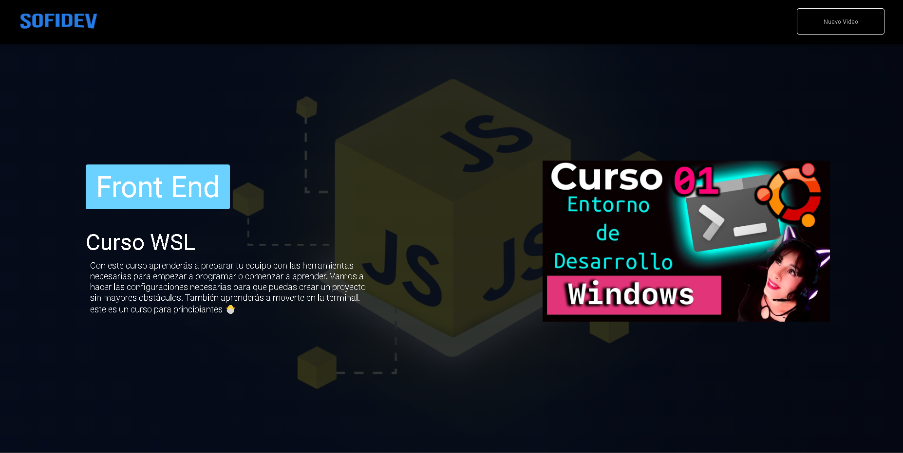
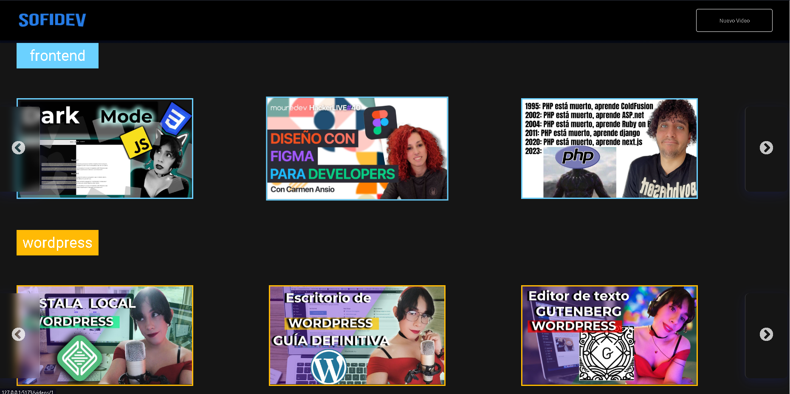

# Oracle One and Alura LATAM Program Final Project

This project is fetching data from a fake api deployed in vercel:[
https://fake-api-aluraflix-two.vercel.app/](
https://fake-api-aluraflix-two.vercel.app/)

This project represents the React challenge, which involves creating a web application similar to Netflix. The project's design is based on the [Figma design](https://www.figma.com/file/jWsqqszcgLAecpsJArCVgI/AluraFlix-ESP-(Copy)?type=design&mode=design&t=SeuJUCGHT8jWQiZf-1) provided by Alura, but you have the flexibility to customize the design to your preferences.


## Project Overview
```javascript
// Crea una instancia de axios con la base de la API
export const api = axios.create({
  baseURL: "https://fake-api-aluraflix-two.vercel.app/",
  /* usa este url pra hacer pruebas CRUD http://localhost:5555/ */
});
```

My project functions by making CRUD requests to a server. I implemented this using a Fake API with JSON Server. If you want to try out this project, I recommend cloning the repository and replacing the Fake API with the `db.json` file found in the project.


This file already contains all the video data, and all you need to do is run the following command to start JSON Server:

```shell
json-server -w -p 5555 db.json
```

Next, replace the `baseURL` in the Axios instance with the JSON Server URL:

```javascript
// Create an Axios instance with the API base URL
export const api = axios.create({
  baseURL: "http://localhost:5555/",
  /* Use this URL for CRUD testing: http://localhost:5555/ */
});
```

Now you can test and interact with the application using the local JSON Server.

## Getting Started

Feel free to clone this repository and customize it to your liking. 💙
